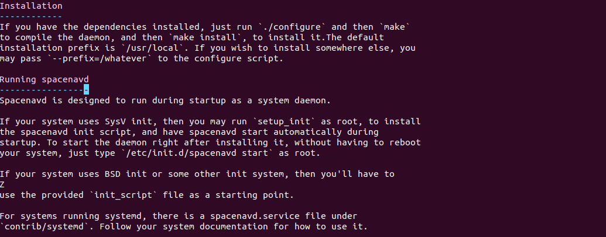
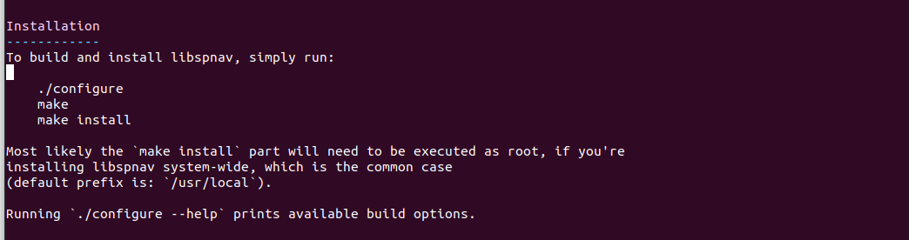
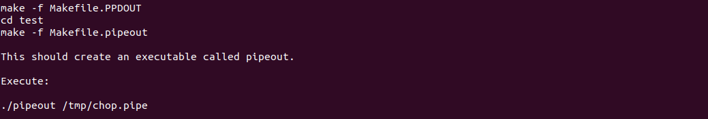

# Author is jasonks2
# Special thanks to NCSA AVL and NASA SVS

# SpacePilot-PRO-for-Houdini-Engine
Features scripts for the Houdini Engine to pipe and interpret SpacePilot PRO inputs

#Requirements:

- A physical SpacePilot 3D Mouse by 3DConnexion (SpacePilot PRO is used for this prototype)
- A legitimate version of the Houdini Engine >18.0.5
- The spacenavd daemon (https://github.com/FreeSpacenav/spacenavd)
- The libspnav extension library (https://github.com/FreeSpacenav/libspnav)

# Step-by-step instructions

** 1. Plug in Space Mouse **

await the "Initializing.." message

** 2. Build environment **

Compile spacenavd by using "--disable-x11" and "--prefix=.." flag (see link above)

Compile libspnav by using "--disable-x11" and "--prefix=.." flag (see link above)

** 3. Build PipeOut applications **

The Houdini Engine natively reads AF_Unix pipes via CHOP Networks

Within the directory of ../../CHOP_Example/

Run -> make -f Makefile.PPDOUT
       cd test
       make -f Makefile.pipeout

** 4. Start Pipeout process **

Run -> ./pipeout /tmp/chop.pipe

Await "Looking for reader"

** 5. Start Houdini Engine **

Load and execute Python file space_mouse.py

** 6. Load and execute <space_mouse.py> Python file **

As opposed to an .HDA, space_mouse.py will:
	- Create a Pipe In Node (name it pipein1) - Location: "/ch/ch1/pipein1"
	- Create a Camera obj linked to the viewport - Location: "/obj/cam1"
	- Register a callback to read the space mouse at clock rate - See space_mouse.py

** 7. Interact and give feedback! **

# TODO

- Key framing is performed at a very high clock frequency due to the hou.playbar.callback registration. Fix this issue by performing a key frame at an interval time. - See space_mouse.py\
- Currently, there is no Edit function to select a keyframe and "teleport" the camera to that position at a certain frame. Fix this issue by implementing a function to correctly call hou.playmode.Loop and hou.playmode.zigzag (reverse playback)

- Buttons on the Space Pilot are not configured to VirDir standard. Fix this issue by copying the VirDir config to the Space Pilot - See space_mouse.py 
- Currently, HDA exports are buggy with errors of nodes referencing external obj's outside of the subnet. Fix this by properly building an HDA from Python

Thanks,

Contact NCSA AVL for issues.

